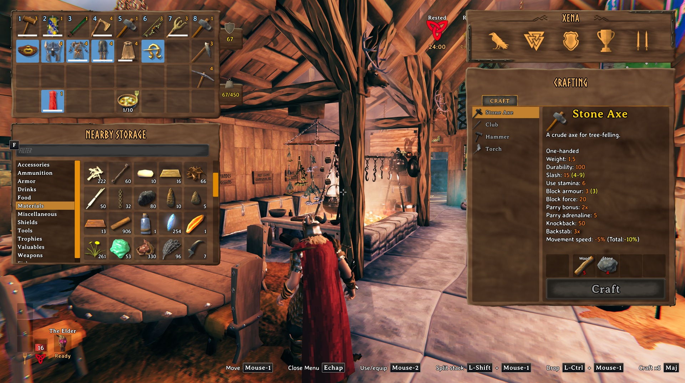

# Nearby Storage

See and use items in nearby containers without opening them one by one. Nearby Storage also lets you craft, build, refuel, and feed machines using nearby supplies.

## How to use it

- Press **Tab** to open your inventory. Nearby Storage appears below it when accessible containers nearby contain items. Choose a category or use the search field to find something.
- **Click** an item in Nearby Storage to pick up one stack. **Shift-click** to choose a quantity. **Ctrl-click** to transfer one stack directly to your inventory.
- **Ctrl-click** an item in your inventory, or drag it anywhere onto Nearby Storage, to store it. The mod chooses a nearby container with room, preferring ones with identical or similar items.
- Hold **Left Alt** while crafting, building, refueling, or feeding a machine to use supplies from your inventory, nearby containers, and, where applicable, ground drops. **Shift + Left Alt** works with Valheim's multicraft amount.

The panel hides while a container is open. Ground drops do not appear in its item list. Containers you cannot access, item stands, armor stands, and tombstones are excluded.

## Settings

The mod searches within **30 m** by default. You can set `SearchRadius` from **5 m to 60 m**, and change `NearbyStorageShortcut` (Left Alt by default) and `KeepOneIngredientPerChest` in `Landoria.NearbyStorage.cfg`. Configuration changes reload while the game is running.

## Screenshot

## Contact

Report bugs through [GitHub Issues](https://github.com/landoria-gaming/Landoria.NearbyStorage/issues).
