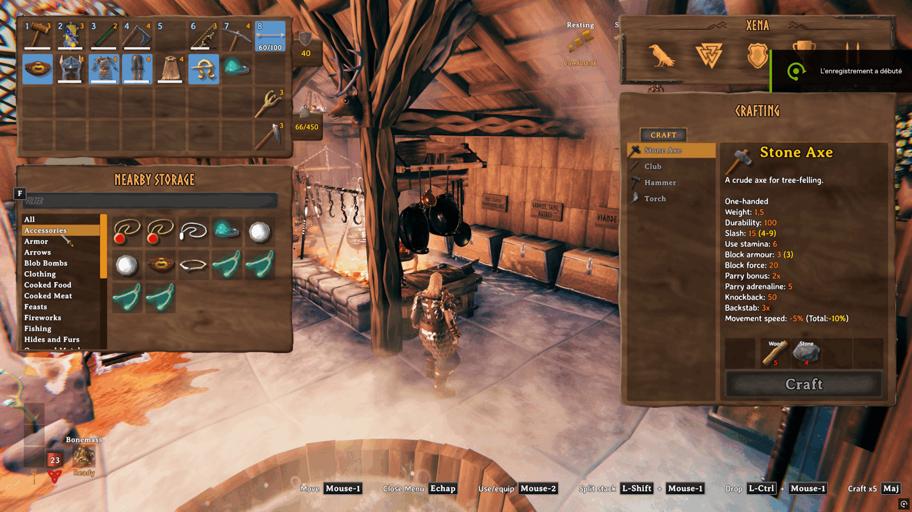

# Nearby Storage

See and use items in nearby chests without opening them one by one. Nearby Storage also lets you name chests and craft, build, refuel, and feed machines using nearby items in chests.

## Nearby Storage panel

- Press **Tab** to open your inventory. Nearby Storage appears below it when accessible nearby containers contain items.
- **Ctrl-click** an inventory stack to store it. With `AutomaticItemDistribution` enabled, the mod distributes it across eligible containers. When disabled, exactly one nearby container must already hold the same item and quality and have room for the whole stack; otherwise, an error appears.
- Drop an item onto an occupied Nearby Storage slot to move it into the same container.
- With `AutomaticItemDistribution` enabled, drop an item onto an empty Nearby Storage slot to distribute it like Ctrl-click.

## Item classification

- See the [category list](CATEGORIES.md) for what each category contains.

## Craft from Nearby Storage

- Hold **Alt** while crafting, building, refueling, or feeding a machine to use supplies from your inventory and nearby containers.
- Hold **Alt** and **Shift** together to use nearby supplies when crafting multiple items at once.

## Renaming containers

- Press **Shift + E** while looking at a wooden, reinforced, or personal chest or a barrel to give it a name if you can open it.

## Including or excluding containers

- Press **Alt + E** while looking at a wooden, reinforced, or personal chest or a barrel to include or exclude it from Nearby Storage for your character.
- Excluded containers are also ignored when crafting, building, refueling, and feeding machines. The default inclusion state is configurable; Alt + E saves either choice explicitly for the character.

## Ping a container

- **Alt + click** a Nearby Storage item to ping its container.

## Settings

Settings are stored in `Landoria.NearbyStorage.cfg` and reload while the game is running.

| Setting | Default | Description |
| --- | --- | --- |
| `SearchRadius` | `60` | Search radius around the player for nearby storage, from 10 to 100 metres. |
| `IncludeChestsByDefault` | `true` | Include chests without an individual inclusion choice. Set to `false` to exclude them by default. |
| `SeparateStacksByContainer` | `true` | Show matching stackable items separately for each container, so you can move a stack from one container to another. Set to `false` to show one combined stack with each container listed in its tooltip. |
| `AutomaticItemDistribution` | `true` | Distribute Ctrl-clicked items among nearby containers. Prefer the same item, a custom name matching the category, a custom name matching its broad family, the most items in its category, the most items in its broad family, an empty container, then any free space. Names match words longer than three letters, ignoring case and accents. |
| `NearbyStorageShortcut` | `Alt` | Hold to use nearby supplies while crafting, building, refueling, or feeding. |

## Contact

Report bugs through [GitHub Issues](https://github.com/landoria-gaming/Landoria.NearbyStorage/issues).

## Preview

